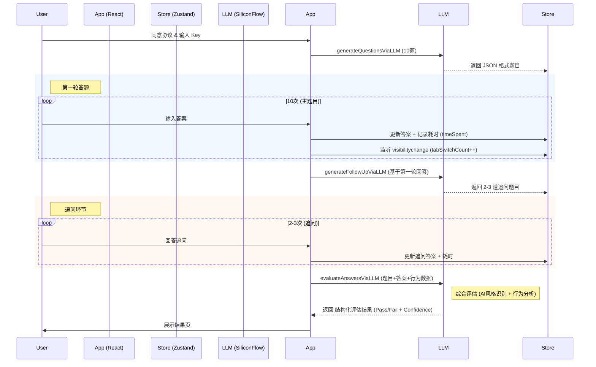

# 核心架构与流程

## 🔄 系统交互流程

本项目的核心是一个基于 LLM 的 **生成-回答-追问-评估** 闭环。

## 🛡️ 反作弊机制设计

为了保证验证的有效性，系统在多个层面植入了反作弊逻辑：

<strong>1. 隐性计时 (Implicit Timing)</strong>

- **机制**：`Quiz` 组件内部维护 `questionStartTime` ref。
- **逻辑**：每次题目切换时，计算 `Date.now() - start`。
- **交互**：数据存入 `questionStore` 的 `timeSpent` 字段。
- **作用**：提交给 LLM 评估。如果某题回答长（>50字）但耗时极短（<5s），LLM 会被 Prompt 指导降低该题置信度。

<strong>2. 页面切换检测 (Tab Switch Detection)</strong>

- **机制**：监听 `document.visibilitychange` 事件。
- **逻辑**：每当 `document.hidden` 变为 `true`，调用 `incrementTabSwitch`。
- **交互**：计数存入 `questionStore`。
- **作用**：作为辅助信号提交给 LLM。频繁切屏（>5次）暗示用户可能在搜索答案。

<strong>3. 追问验证 (Follow-up Challenge)</strong>

- **机制**：`generateFollowUpViaLLM`。
- **逻辑**：将用户第一轮的 "QA对" 发送给 LLM，要求 LLM 针对其中 2-3 个具体回答提出后续问题。
- **作用**：破坏 AI 代答的一致性。AI 生成的初次回答通常是闭环的，面对针对细节的追问（如"后来怎么解决的？"），代答往往无法编造出符合逻辑且有体感的后续。

